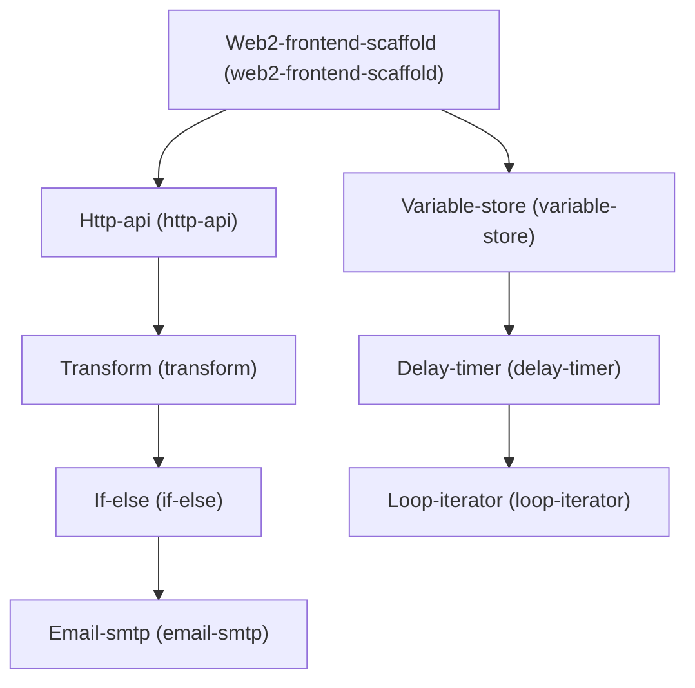

# Architecture

## Dependency Graph

## Execution / Implementation Order

1. **Web2-frontend-scaffold** (`fe90565a`)
2. **Http-api** (`6e075014`)
3. **Variable-store** (`827124c2`)
4. **Transform** (`c02bc1d2`)
5. **Delay-timer** (`1ea713b4`)
6. **If-else** (`1d4b3662`)
7. **Loop-iterator** (`73819d58`)
8. **Email-smtp** (`847a5288`)
